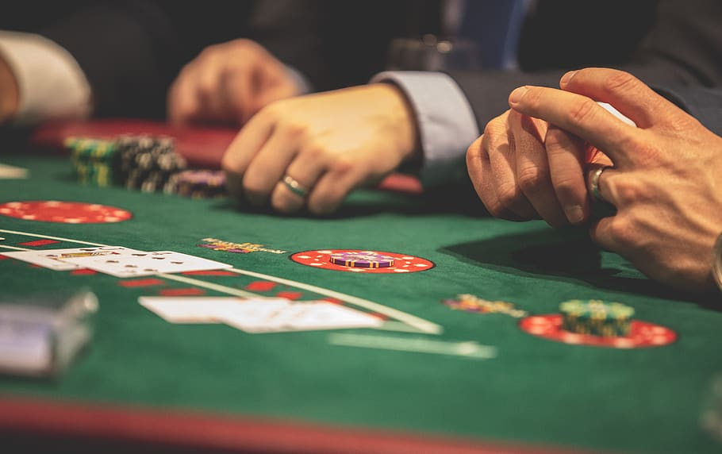
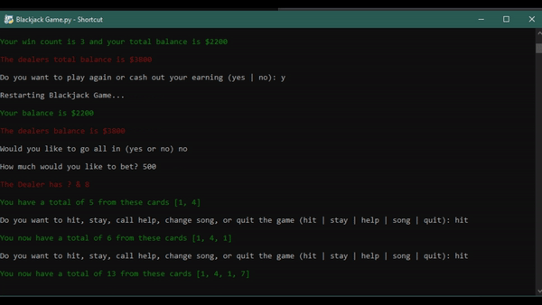

<h1 align="center">
    Blackjack 21 🃏
</h1>

    
    
        
        
     
    
     
     
     
        

    

# Description 🃏
- This is a game where you play against the dealer and try to get the higher values of cards without exceeding over the number 21. If your cards ever equal a total of 21, you automatically get blackjack (win) unless both you, and the dealer get 21 then you push (tie). The user also has a cash balance that is wagered based on winning or losing, the user must keep their cash balance positive and not negative to keep playing. All the basic rules that are applied to the traditional game of Blackjack 21 are also applied to this card game project along with many great features and additions. If you are unfamiliar or do not know how to play Blackjack 21 and would like to learn it, [visit](https://youtu.be/eyoh-Ku9TCI).

# Demonstration 📹

# Instructions 🎲
### Option 1 (Python not installed)
1. If you do not have python installed on your Windows system, or you just do not feel like using python, simply just [download](https://github.com/JordanLeich/Blackjack-21/blob/master/main.exe) the exe file.
2. Make sure to run main.exe as administrator or else the game will not have the permission to write to a save file!

### Option 2 (Python installed)
1. Make sure you installed all the python modules found in the requirements document [here](https://github.com/JordanLeich/Blackjack-21/blob/master/requirements.txt).
2. Go to the releases page on GitHub and download the [latest](https://github.com/JordanLeich/Blackjack-21/releases) zip file.
3. unzip the zip file wherever you like, simply run main.py.

# Additional 📓
1. [Latest](https://github.com/JordanLeich/Blackjack-21/releases) version of Blackjack 21, this release is the most recommended for players and developers. The latest release will always contain completed code and will be considered a stable, working release.
2. [Oldest](https://github.com/JordanLeich/Blackjack-21/releases/tag/v5.0) version of Blackjack 21, this release is super outdated and lacks hundreds of improvements and features. Ideally, this version is best if you don't want all the newest features but want the most basic version of Blackjack 21.

# TODO List ❗
- View the TODO List [here](https://github.com/JordanLeich/Blackjack-21/issues/3)

# Contributing ✍️
- Here’s an easy and quick [video guide](https://youtu.be/waEb2c9NDL8) for learning how to contribute via GitHub 

# Bug Reporting 🐞
- Report a bug [here](https://github.com/JordanLeich/Blackjack-21/issues/5)
