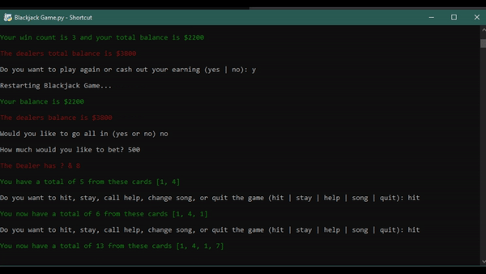

  

# [Requirements](https://github.com/JordanLeich/Blackjack-21/blob/master/Requirements.txt) ⚡
1. Colored (pip install colored)
1. Playsound (pip install playsound)
1. It is always a great idea to keep your pip updated but it is not required. If you pip is too outdated, you may run into some issues with installing other python modules and packages.

# Description 🃏
- This is a game where you play against the dealer and try to get the higher values of cards without exceeding over the number 21. If your cards ever equal a total of 21, you automatically get blackjack (win) unless both you and the dealer get 21 then you push (tie). The user also has a cash balance that is wagered based on winning or losing, the user must keep their cash balance positive and not negative to keep playing. All of the basic rules that are applied to the traditional game of Blackjack 21 are also applied to this card game project along with many great features and additions. If you are unfamiliar or do not know how to play Blackjack 21 and would like to learn it, [visit](https://youtu.be/eyoh-Ku9TCI).

# Demonstration 📹

# Instructions 🎲
1. Make sure you installed all the python modules found in the requirements tab
2. Go to the releases page on GitHub and download the [latest](https://github.com/JordanLeich/Blackjack-21/releases) zip file
3. unzip the zip file wherever you like, simply run Blackjack.py, and enjoy!

# Additional 📓
1. [Latest](https://github.com/JordanLeich/Blackjack-21/releases) version of Blackjack 21, this release is the most recommended for players and developers. The latest release will always contain completed code and will be considered a stable, working project.
2. [Oldest](https://github.com/JordanLeich/Blackjack-21/releases/tag/v5.0) version of Blackjack 21, this release is super outdated and lackes hundreds of improvements and features.

# TODO List ❗
1. Check out the issues page for this project [here](https://github.com/JordanLeich/Blackjack-21/issues/3)

